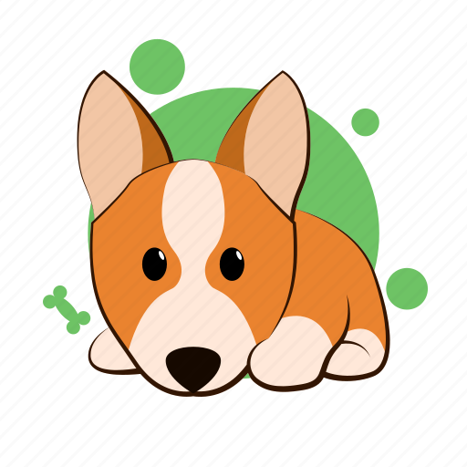

# Dog API 
#### Individual Project for Henry Bootcamp

## Project Goals

- Build an App using React, Redux, Node and Sequelize.
- Reinforce and connect the concepts learned in the course.
- Learn best practices.
- Learn and practice GIT workflow.

## Development timeframe

The all project had an execution time of 20 days. Starting with a boilerplate with the general structure of both the server and the client

## Functionalities

- List breeds by visualizing them by paging.
- View the details of each breed.
- Search breeds by name.
- Filter by data source and temperament.
- Sort alphabetically or by weight.
- Add new breeds to a database.

### Endpoints/Flags

- GET <https://api.thedogapi.com/v1/breeds>
- GET <https://api.thedogapi.com/v1/breeds/search?q={dog_breed}>

## Main Technologies

- Frontend: **_React, Redux Toolkit, React Router, Styled Components_**
- Backend: **_nodeJS, ExpressJS, Sequelize, PostgreSQL, Axios_**

## 🔗 Demo: 
[breeds-app.vercel.app](https://breeds-app.vercel.app) 

## Screenshots

| Landing      | Homepage |
| ----------- | ----------- |
|  |  |

| Detail page      | Create page |
| ----------- | ----------- |
|  |  |

